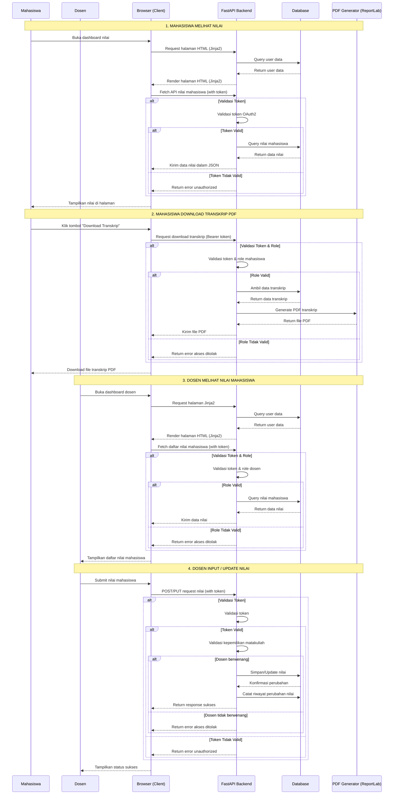

```mermaid
sequenceDiagram
    participant Mahasiswa as Mahasiswa
    participant Dosen as Dosen
    participant Browser as Browser (Client)
    participant FastAPI as FastAPI Backend
    participant Database as Database
    participant PDFGen as PDF Generator (ReportLab)

    Note over Mahasiswa, PDFGen: 1. MAHASISWA MELIHAT NILAI
    Mahasiswa->>Browser: Buka dashboard nilai
    Browser->>FastAPI: Request halaman HTML (Jinja2)
    FastAPI->>Database: Query user data
    Database-->>FastAPI: Return user data
    FastAPI-->>Browser: Render halaman HTML (Jinja2)
    Browser->>FastAPI: Fetch API nilai mahasiswa (with token)
    alt Validasi Token
        FastAPI->>FastAPI: Validasi token OAuth2
        alt Token Valid
            FastAPI->>Database: Query nilai mahasiswa
            Database-->>FastAPI: Return data nilai
            FastAPI-->>Browser: Kirim data nilai dalam JSON
        else Token Tidak Valid
            FastAPI-->>Browser: Return error unauthorized
        end
    end
    Browser-->>Mahasiswa: Tampilkan nilai di halaman

    Note over Mahasiswa, PDFGen: 2. MAHASISWA DOWNLOAD TRANSKRIP PDF
    Mahasiswa->>Browser: Klik tombol "Download Transkrip"
    Browser->>FastAPI: Request download transkrip (Bearer token)
    alt Validasi Token & Role
        FastAPI->>FastAPI: Validasi token & role mahasiswa
        alt Role Valid
            FastAPI->>Database: Ambil data transkrip
            Database-->>FastAPI: Return data transkrip
            FastAPI->>PDFGen: Generate PDF transkrip
            PDFGen-->>FastAPI: Return file PDF
            FastAPI-->>Browser: Kirim file PDF
        else Role Tidak Valid
            FastAPI-->>Browser: Return error akses ditolak
        end
    end
    Browser-->>Mahasiswa: Download file transkrip PDF

    Note over Dosen, PDFGen: 3. DOSEN MELIHAT NILAI MAHASISWA
    Dosen->>Browser: Buka dashboard dosen
    Browser->>FastAPI: Request halaman Jinja2
    FastAPI->>Database: Query user data
    Database-->>FastAPI: Return user data
    FastAPI-->>Browser: Render halaman HTML (Jinja2)
    Browser->>FastAPI: Fetch daftar nilai mahasiswa (with token)
    alt Validasi Token & Role
        FastAPI->>FastAPI: Validasi token & role dosen
        alt Role Valid
            FastAPI->>Database: Query nilai mahasiswa
            Database-->>FastAPI: Return data nilai
            FastAPI-->>Browser: Kirim data nilai
        else Role Tidak Valid
            FastAPI-->>Browser: Return error akses ditolak
        end
    end
    Browser-->>Dosen: Tampilkan daftar nilai mahasiswa

    Note over Dosen, PDFGen: 4. DOSEN INPUT / UPDATE NILAI
    Dosen->>Browser: Submit nilai mahasiswa
    Browser->>FastAPI: POST/PUT request nilai (with token)
    alt Validasi Token
        FastAPI->>FastAPI: Validasi token
        alt Token Valid
            FastAPI->>FastAPI: Validasi kepemilikan matakuliah
            alt Dosen berwenang
                FastAPI->>Database: Simpan/Update nilai
                Database-->>FastAPI: Konfirmasi perubahan
                FastAPI->>Database: Catat riwayat perubahan nilai
                FastAPI-->>Browser: Return response sukses
            else Dosen tidak berwenang
                FastAPI-->>Browser: Return error akses ditolak
            end
        else Token Tidak Valid
            FastAPI-->>Browser: Return error unauthorized
        end
    end
    Browser-->>Dosen: Tampilkan status sukses
```