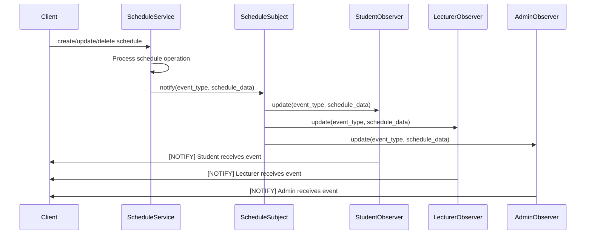

# Schedule System Documentation

## Architecture

The Schedule System is designed as a modular component that integrates with the existing PMB (Penerimaan Mahasiswa Baru) and KRS (Kartu Rencana Studi) systems. The architecture follows a service-oriented pattern with clear separation of concerns:

- **Models**: Define the database entities (JadwalKelas, Ruang, Dosen, etc.)
- **Services**: Contain the business logic (CRUD operations, validation, conflict detection)
- **Observer Pattern**: Implements notification system for schedule changes
- **Endpoints**: API layer that exposes the functionality
- **AI Rescheduler**: Intelligent conflict resolution system

## Conflict Detection

The conflict detection system uses an optimized algorithm to identify three types of conflicts across schedules:

1. **Room Conflicts**: Occurs when two classes are scheduled in the same room at overlapping times on the same day
2. **Lecturer Conflicts**: Occurs when a lecturer is assigned to teach two classes at overlapping times on the same day
3. **Time Overlaps**: General time conflicts regardless of room or lecturer

The algorithm optimizes performance by:
- Grouping schedules by day for processing
- Sorting schedules by start time 
- Using interval checking to efficiently detect overlaps
- Only comparing schedules that have potential to overlap

## Observer Pattern Sequence Diagram



## API Usage Examples

### Create Schedule
```bash
POST /api/schedule/create
{
  "kode_mk": "CS101",
  "dosen_id": 1,
  "ruang_id": 1,
  "semester": "2023/2024-1",
  "hari": "Senin",
  "jam_mulai": "09:00:00",
  "jam_selesai": "11:00:00",
  "kapasitas_kelas": 25,
  "kelas": "A"
}
```

### Update Schedule
```bash
PUT /api/schedule/{id}/update
{
  "hari": "Selasa",
  "jam_mulai": "10:00:00",
  "jam_selesai": "12:00:00"
}
```

### Get Schedule Conflicts
```bash
GET /api/schedule/conflicts
```

### Get Available Rooms
```bash
GET /api/schedule/rooms
```

## AI Rescheduler Logic

The AI Rescheduler provides intelligent suggestions for resolving schedule conflicts. The algorithm evaluates available time slots based on multiple criteria:

1. **Room Capacity**: Ensures the suggested room has enough capacity for all registered students
2. **Lecturer Availability**: Verifies the lecturer is free during the suggested time
3. **Student Conflicts**: Checks that the new time doesn't conflict with students' existing schedules
4. **Minimal Disruption**: Prioritizes morning slots first, then afternoon, then evening

The system returns up to 3 alternative suggestions with detailed reasons for each, helping administrators make informed decisions about schedule adjustments.

### Suggestion Criteria Priority:
- Morning slots (08:00-11:00) are preferred
- Afternoon slots (12:00-15:00) are secondary
- Evening slots (after 15:00) are last priority
- Same room preference when possible to minimize disruption

The AI system ensures that all constraints are satisfied while minimizing the impact on students and lecturers.